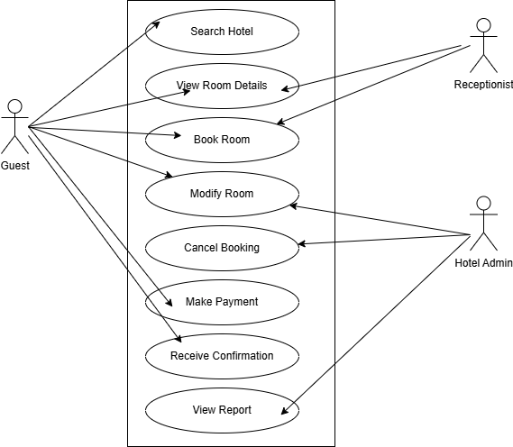

# Requirement Analysis in Software Development
📌 Requirement Analysis in software development is the detailed process of defining, analysing and documenting what a software system should do and what constraints it must operate under. It's essentially the blueprinting stage before any code is written. This directory is a blueprint for a detailed requirement analysis phase for a booking management system. This project simulates a real-world development scenario, emphasising clarity, precision, and structure in defining requirements to set the stage for successful project execution

## What is Requirement Analysis?
Requirement Analysis is basically what a system needs to do and the conditions it must satisfy to be successful. It's essentially about defining the "what" before jumping into the "how.
Here’s why it’s essential in the SDLC:
- Reduces development cost by minimising rework due to misunderstood needs
- Improves client satisfaction by delivering what was truly needed
- Ensures better collaboration across teams through shared understanding
- Provides clear benchmarks for testing and validation
- Enhances product quality by aligning development with real-world use cases

## Why is Requirement Analysis Important?
🧠 Key Reasons
- Clarify what the client or end-user wants
- Convert vague ideas into structured, testable requirements
- Lay a concrete foundation for development and testing
- Avoid miscommunication and scope creep

## Key Activities in Requirement Analysis.
### 🧲 1. Requirement Gathering
This is the initial step of gathering all relevant information from stakeholders to understand what the software needs to achieve.
- Involves interviews, questionnaires, surveys, and reviewing documents.
- Focuses on understanding current challenges, goals, and expectations of end-users and clients.
- Helps capture the big picture: business goals, technical constraints, and user roles.
- Acts as the bridge between desired and possible outcomes within budget and time.

### 💬 2. Requirement Elicitation
Think of this as drawing out information that stakeholders may not explicitly express.
- Uses techniques like use cases, focus groups, brainstorming sessions, and observation.
- Helps uncover tacit needs, hidden assumptions, and contradictions.
- Encourages collaborative discussions that align priorities across different stakeholder groups.
- Especially valuable when clients have vague or conflicting ideas—this step brings clarity.

### 📝 3. Requirement Documentation
Once the information is collected and understood, it's formally written down so everyone’s on the same page.
- Results in artefacts like the Software Requirements Specification (SRS), user stories, or product backlogs.
- Should be clear, complete, unambiguous, and testable.
- Organises requirements into categories (functional, non-functional, business, system).
- Becomes a reference point for designers, developers, and testers throughout the project.

### 🔍 4. Requirement Analysis and Modelling
The documented needs are analysed deeply to break things down, resolve conflicts, and build models to visualise the system.
- Involves prioritising, refining, and validating dependencies between requirements.
- May include techniques like data flow diagrams, entity-relationship diagrams, user flow charts, and wireframes.
- Helps identify edge cases, technical risks, and feasibility issues early.
- Transforms text-heavy requirements into logical structures that guide implementation and UX design.

### ✅ 5. Requirement Validation
Before design and development begin, you confirm that the requirements are validated.
- Conducted through reviews, walkthroughs, and prototyping with stakeholders.
- Ensures each requirement is:
- Accurate (matches user intent)
- Relevant (adds value)
- Feasible (can be built)
- Testable (measurable and verifiable)
- Prevents costly mistakes by catching misinterpretations early.
- Builds confidence among clients and teams that you’re on track.

## Types of Requirements

### 📊 Hotel Booking Platform Requirement

| Subsection                 | Functional Requirements                                                                                                             | Non-functional Requirements                                                                                                                      |
|---------------------------|-------------------------------------------------------------------------------------------------------------------------------------|--------------------------------------------------------------------------------------------------------------------------------------------------|
| **1. User Booking Experience** | - Search hotels by location, date, amenities, etc.    - Check real-time room availability    - Book rooms with guest details    - Process payments securely    - Send booking confirmation via email/SMS | - Search results load within 2 seconds    - Handles thousands of users during peak times    - Secures payments    - Mobile-friendly design    - 99.9% uptime |
| **2. Hotel Management Operations** | - Manage room inventory (add/edit/delete rooms)    - View and update reservations    - Set dynamic pricing/promotions    - Track guest check-in/out    - Respond to guest reviews | - Modular backend for easy updates    - Data stays accurate across dashboards    - Action logs for audit trails    - Multi-language and currency support    - Instant reflection of staff changes |

## Use Case Diagrams

Use case diagrams are visual representations that show how different users (actors) interact with the system to achieve specific goals (use cases).

### Benefits Include
- User-Centric Design: Helps teams focus on what users need from the system.
- Clear Communication: Bridges the gap between technical and non-technical stakeholders.
- Scope Definition: Outlines what’s inside and outside the system.
- Foundation for Development: Guides UI/UX design, testing, and feature planning.
- Early Error Detection: Identifies missing or conflicting requirements early in the SDLC.

Diagram:

